<div align="center">
  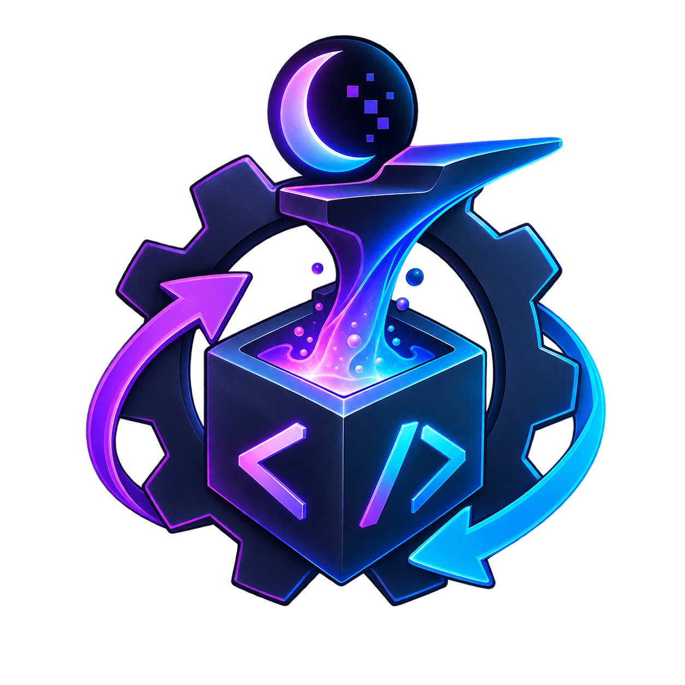
  <h1>🛠️ CompactForge</h1>
  <p><strong>The Developer Infrastructure Suite & CI/CD Pipeline for Midnight Network Compact Contracts</strong></p>

  <p>
    
    
    
    
    
    
  </p>

  <p>
    
    
  </p>
</div>

---

> ⚠️ **Disclaimer:** This project and all smart contracts are deployed and tested exclusively on the **Midnight Network PREPROD** environment. All blockchain references, explorer links, and transactions belong to the Preprod network.

### 🔗 Important Links
* **Live Preprod Demo:** [https://compactforge-midnight.vercel.app/](https://compactforge-midnight.vercel.app/) *(Live CompactForge Application on Preprod)*
* **Documentation:** [https://compactforge-midnight.vercel.app/docs](https://compactforge-midnight.vercel.app/docs) *(Complete documentation for the CompactForge project)*
* **Demo Video:** [Watch the CompactForge Demo on YouTube](https://youtu.be/uWtSPvXCc7Y) *(Watch the full demo)*
* **X Profile Link:** [https://x.com/compactforgee](https://x.com/compactforgee) *(Follow us on X)*

---

<br>

## Project Documentation Files

* **Setup Guide:** [SETUP.md](./SETUP.md) *(Step-by-step instructions for setting up the project)*
* **Usage Guide:** [USAGE.md](./USAGE.md) *(Instructions for using the project)*
* **Proposal:** [PROPOSAL.md](./PROPOSAL.md) *(The original proposal document)*

<br>

---

## 💡 The Problem & Our Solution

**The Problem**
Building privacy-preserving smart contracts in Zero-Knowledge (ZK) is incredibly complex. For developers building on the **Midnight Network** using the **Compact** language, the friction doesn't stop at learning the language. Developers lack the fundamental Web2-style infrastructure they are used to:
- No automated CI/CD pipelines to compile and verify `.compact` files on every commit.
- No easy way to track **Proving Times** (benchmarks) across different commits to see if a code change made generating ZK proofs slower or faster.
- No unified dashboard to instantly deploy contracts and interact with them in the browser using the 1AM wallet.

**The Solution: CompactForge**
CompactForge bridges the gap by giving every Midnight team a unified CI/CD and DevOps dashboard.
1. **Automated CI/CD:** Our GitHub Actions automatically compile Compact circuits.
2. **Proof Benchmarking:** CI runs time how long it takes to generate ZK proofs for each circuit and saves this directly to our Neon Postgres database.
3. **One-Click Deploy & Interact:** Connect your 1AM wallet to seamlessly deploy contracts and call any circuit directly from the web dashboard.

---

## 🔐 Public State vs. Private Witness

Midnight brings privacy to smart contracts. To demonstrate this, CompactForge includes a fully featured `token_ledger` contract featuring 6 unique ZK circuits (`mint`, `transfer`, `deposit`, `burn`, `pause`, `unpause`).

* **Public State (On-Chain):** Data that is globally visible and verifiable by anyone. In our contract, `balances`, `totalSupply`, `ownerCount`, `admin`, and `paused` are public state variables. 
* **Private Witness (Off-Chain):** Secret data that never touches the blockchain. In our contract, the user's `localSecretKey()` is a private witness. The ZK circuit proves that the caller holds the correct secret key to authorize a transfer or mint, without ever revealing the key itself on the public ledger.

---

## 📸 Product Walkthrough

<div align="center">
  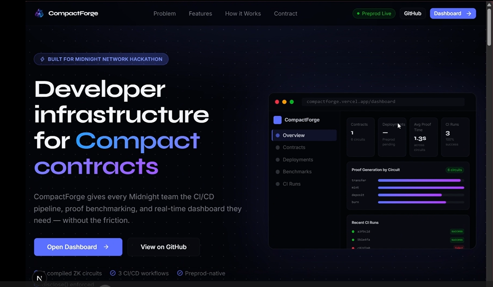
  <p><em>The CompactForge landing page showcasing features and architecture.</em></p>
  <br/>

  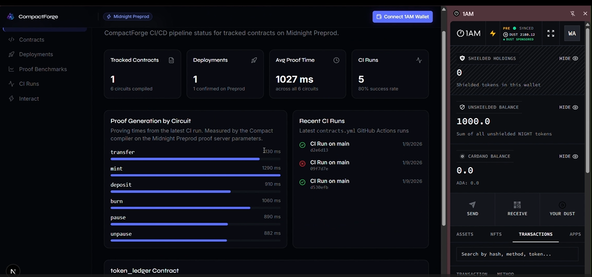
  <p><em>The developer dashboard aggregating deployments, runs, and CI metrics.</em></p>
  <br/>

  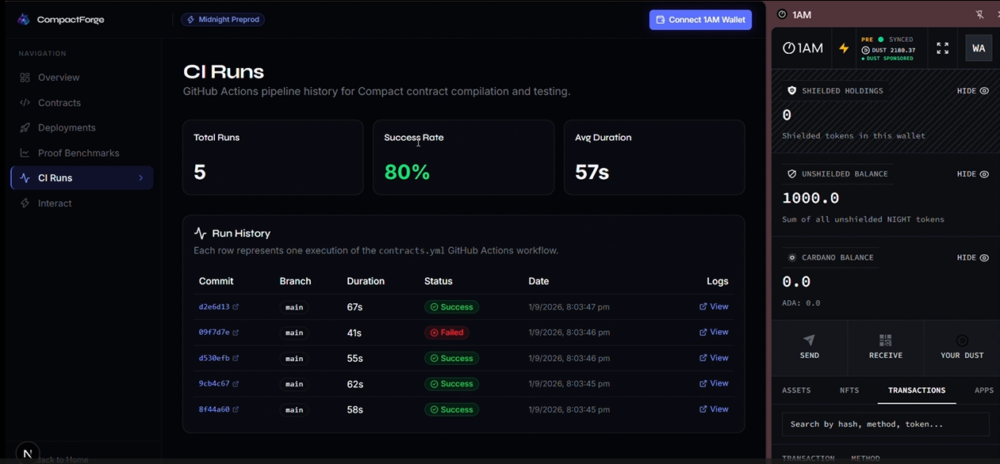
  <p><em>Live GitHub Actions CI/CD history synced directly to the dashboard.</em></p>
  <br/>

  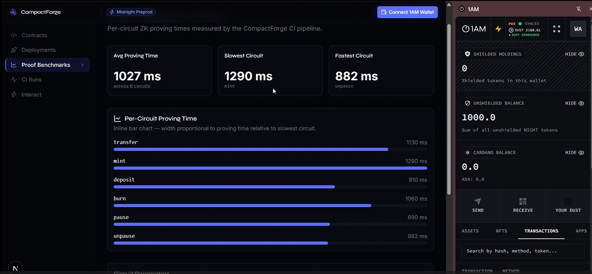
  <p><em>ZK Proof Generation benchmarking tracked across commits for performance optimization.</em></p>
  <br/>

  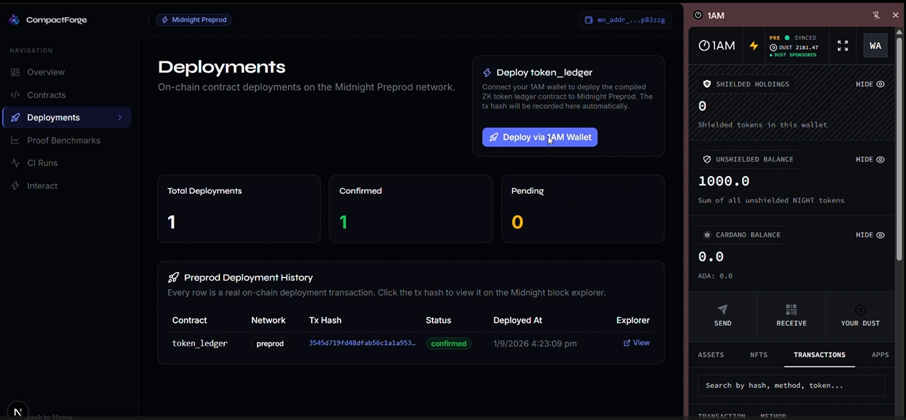
  <p><em>One-click smart contract deployment interface powered by the 1AM wallet.</em></p>
  <br/>

  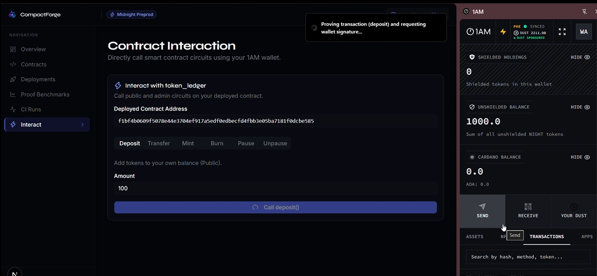
  <p><em>Interactive terminal to generate ZK proofs and execute circuit methods on the Preprod network.</em></p>
  <br/>

  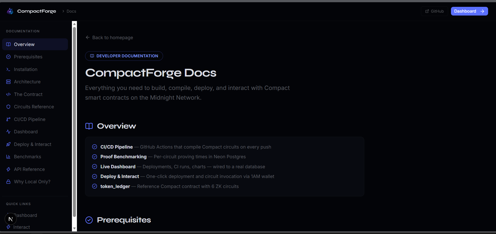
  <p><em>Comprehensive API reference and developer documentation built into the app.</em></p>
</div>

---

## 📜 The Smart Contract

The core of our testing and demonstration is the `token_ledger.compact` contract.

**Preprod Network Deployments:**

| Contract Name | Full Contract Address | Verify Link (Preprod) |
|---|---|---|
| `token_ledger.compact` | `f1bf4b0609f5078e44e3704ef917a5edf0edbecfd4fbb3e05ba7181f0dcbe585` | [View on 1AM Explorer](https://explorer.1am.xyz/contract/f1bf4b0609f5078e44e3704ef917a5edf0edbecfd4fbb3e05ba7181f0dcbe585?network=preprod) |

**Sample Transactions (Preprod):**

| Transaction Type | Full TxHash | Verify Link (Preprod) |
|---|---|---|
| Contract Deployment | `505092cdae10713eeb5a4f47af05da3414b92afa7a81a8c1b7153d47e68e090f` | [View on 1AM Explorer](https://explorer.1am.xyz/tx/505092cdae10713eeb5a4f47af05da3414b92afa7a81a8c1b7153d47e68e090f?network=preprod) |
| Sample ZK Deposit | `a7eccdd4b6027d1a222ef43a40de1dce6cbf56ecadaa0d93093b7b9ffdc02406` | [View on 1AM Explorer](https://explorer.1am.xyz/tx/a7eccdd4b6027d1a222ef43a40de1dce6cbf56ecadaa0d93093b7b9ffdc02406?network=preprod) |

<br>

### Screenshots of the Smart Contract in Action

<br>

<div align="center">
  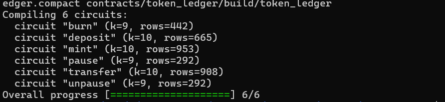
  <p><em>The compiled ZK Proving and Verifying keys tracked securely.</em></p>
  <br/>

  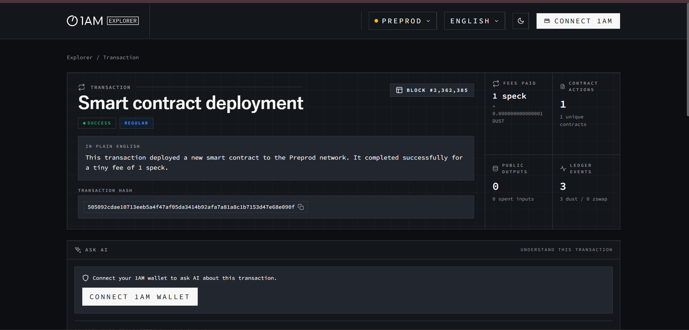
  <p><em>Verified smart contract deployments on the Midnight Preprod Network.</em></p>
  <br/>

  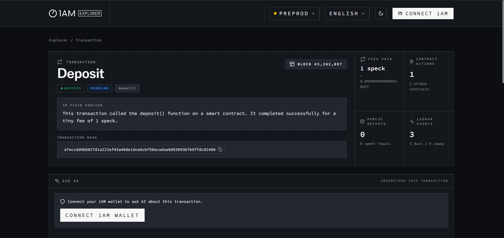
  <p><em>Executing the deposit circuit to shield funds via Zero-Knowledge proofs.</em></p>
</div>

---

## 🏗️ Architecture Diagrams

### Project Architecture (CI/CD Flow)
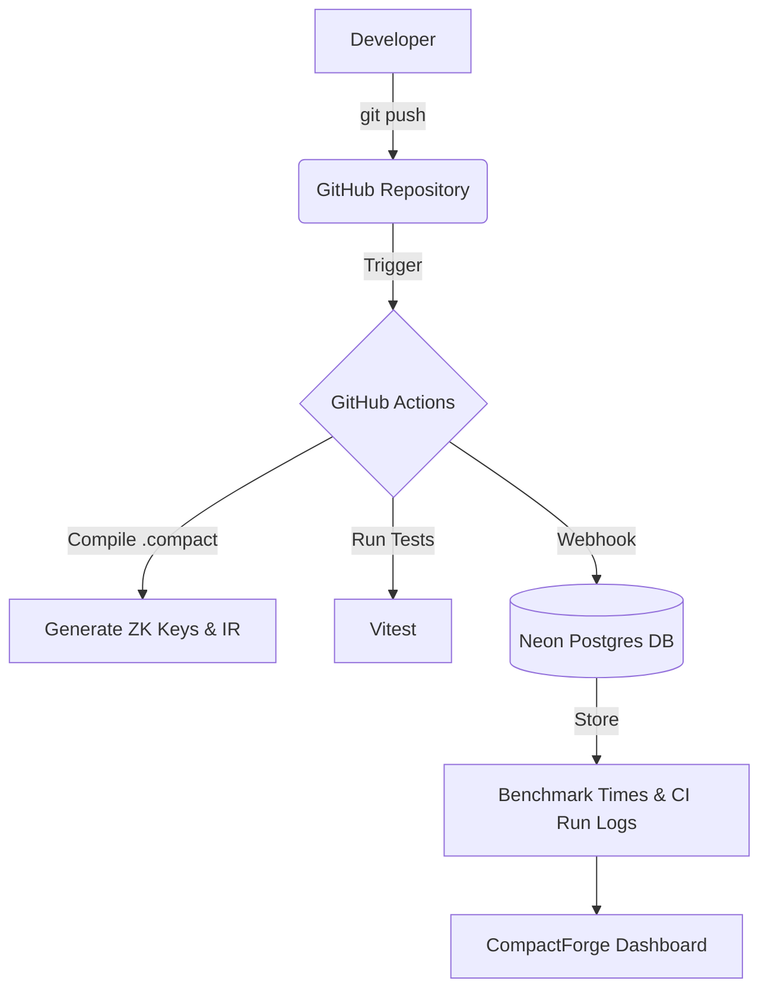

### User Workflow (Deploy & Interact)
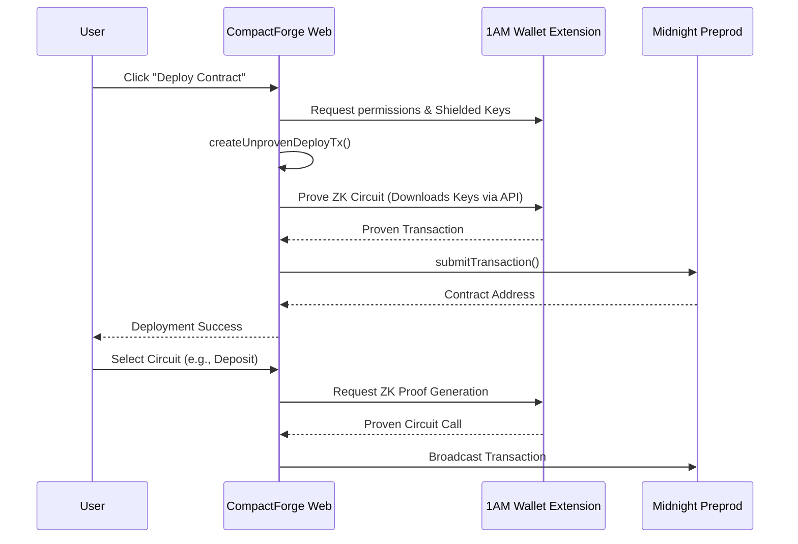

---

## 📁 File Structure

```text
CompactForge/
├── src/
│   ├── app/
│   │   ├── api/            # Next.js API Routes (CI Webhooks, DB access)
│   │   │   └── contracts/  # Serves .bzkir, .prover, .verifier binaries locally
│   │   ├── dashboard/      # Web dashboard pages (Next.js App Router)
│   │   └── docs/           # Documentation generated natively
│   ├── components/         # React Components (DeployButton, InteractPanel, etc)
│   └── __tests__/          # Vitest Unit test suite
├── contracts/
│   └── token_ledger/       
│       ├── token_ledger.compact    # The Midnight Compact source code
│       └── build/                  # Generated WASM, Keys, and ZK IR
├── prisma/
│   └── schema.prisma       # Database Schema (Neon Postgres)
└── .github/workflows/      # GitHub Actions CI/CD pipelines
```

---

## 🧪 Test Cases

The project utilizes `vitest` for robust unit testing covering utility functions, API endpoint validation, Contract metadata, and our custom ZK config provider URLs.

To run the tests:
```bash
npm run test
```

<div align="center">
  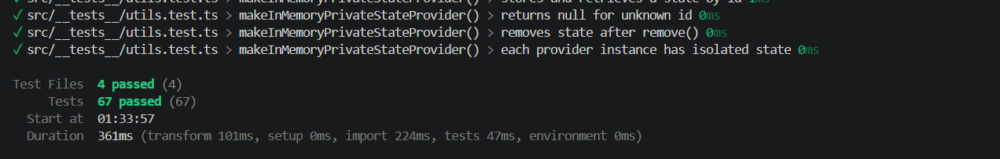
  <p><em>Vitest running the comprehensive 67-test suite to validate our APIs and SDK configuration.</em></p>
</div>

---

## 🚀 Future Implementations & Real World Applications

**Future Roadmap:**
1. **Multi-Contract Support:** Dynamically upload, compile, and manage any `.compact` file directly in the browser using WASM.
2. **Advanced Analytics:** Track gas fees, proving size optimization recommendations, and failure rate tracking for ZK circuits over time.
3. **Automated Auditing:** CI/CD step that statically analyzes Compact contracts for common privacy leaks.

**Real World Application:**
CompactForge sets the standard for how development teams building on Midnight will handle their release cycles. By standardizing CI/CD for ZK proofs, teams can build decentralized confidential ledgers, voting systems, and privacy-preserving identity systems with the confidence that every commit is mathematically verified and performance benchmarked before reaching production.

---

### 🙏 Salutation
**A huge thanks to the Midnight Team for organizing this hackathon!** Building with Compact and exploring the frontier of Zero-Knowledge smart contracts has been an incredible experience.

<div align="center">
  <b>Built with ❤️ for the Midnight Ecosystem</b>
</div>
