<div align="center">
  
  <h1>🛠️ CompactForge</h1>
  <p><strong>The Developer Infrastructure Suite & CI/CD Pipeline for Midnight Network Compact Contracts</strong></p>

  <p>
    
    
    
    
    
    
  </p>

  <p>
    
    
  </p>
</div>

---

> ⚠️ **Disclaimer:** This project and all smart contracts are deployed and tested exclusively on the **Midnight Network PREPROD** environment. All blockchain references, explorer links, and transactions belong to the Preprod network.

### 🔗 Important Links
* **Live Preprod Demo:** [https://compactforge-midnight.vercel.app/](https://compactforge-midnight.vercel.app/) *(Live CompactForge Application on Preprod)*
* **Product Pitch Deck** : [CompactForge Product Deck](https://docs.google.com/presentation/d/1prB6MAuPms73S8TNJqzjWTZ-r2PgxhrdArH_ocebhWo/edit?usp=sharing) *(Google Slide Link)*
* **Documentation:** [https://compactforge-midnight.vercel.app/docs](https://compactforge-midnight.vercel.app/docs) *(Complete documentation for the CompactForge project)*
* **Demo Video:** [Watch the CompactForge Demo on YouTube](https://youtu.be/uWtSPvXCc7Y) *(Watch the full demo)*
* **X Profile Link:** [https://x.com/compactforgee](https://x.com/compactforgee) *(3+ posts in September on X)*

---

<br>

## Project Documentation Files

* **Setup Guide:** [SETUP.md](./SETUP.md) *(Step-by-step instructions for setting up the project)*
* **Usage Guide:** [USAGE.md](./USAGE.md) *(Instructions for using the project)*
* **Proposal:** [PROPOSAL.md](./PROPOSAL.md) *(The original proposal document)*

<br>

---

## 💡 The Problem & Our Solution

**The Problem**
Building privacy-preserving smart contracts in Zero-Knowledge (ZK) is incredibly complex. For developers building on the **Midnight Network** using the **Compact** language, the friction doesn't stop at learning the language. Developers lack the fundamental Web2-style infrastructure they are used to:
- No automated CI/CD pipelines to compile and verify `.compact` files on every commit.
- No easy way to track **Proving Times** (benchmarks) across different commits to see if a code change made generating ZK proofs slower or faster.
- No unified dashboard to instantly deploy contracts and interact with them in the browser using the 1AM wallet.

**The Solution: CompactForge**
CompactForge bridges the gap by giving every Midnight team a unified CI/CD and DevOps dashboard.
1. **Automated CI/CD:** Our GitHub Actions automatically compile Compact circuits.
2. **Proof Benchmarking:** CI runs time how long it takes to generate ZK proofs for each circuit and saves this directly to our Neon Postgres database.
3. **One-Click Deploy & Interact:** Connect your 1AM wallet to seamlessly deploy contracts and call any circuit directly from the web dashboard.

---

## 🔒 Public State vs. Private Witness

Midnight brings privacy to smart contracts. To demonstrate this, CompactForge includes a fully featured `token_ledger` contract featuring 6 unique ZK circuits (`mint`, `transfer`, `deposit`, `burn`, `pause`, `unpause`).

* **Public State (On-Chain):** Data that is globally visible and verifiable by anyone. In our contract, `balances`, `totalSupply`, `ownerCount`, `admin`, and `paused` are public state variables. 
* **Private Witness (Off-Chain):** Secret data that never touches the blockchain. In our contract, the user's `localSecretKey()` is a private witness. The ZK circuit proves that the caller holds the correct secret key to authorize a transfer or mint, without ever revealing the key itself on the public ledger.

---

## 🚀 Product Walkthrough

<div align="center">
  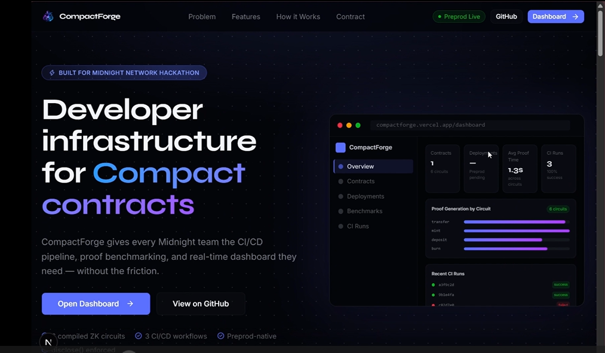
  <p><em>The CompactForge landing page showcasing features and architecture.</em></p>
  <br/>

  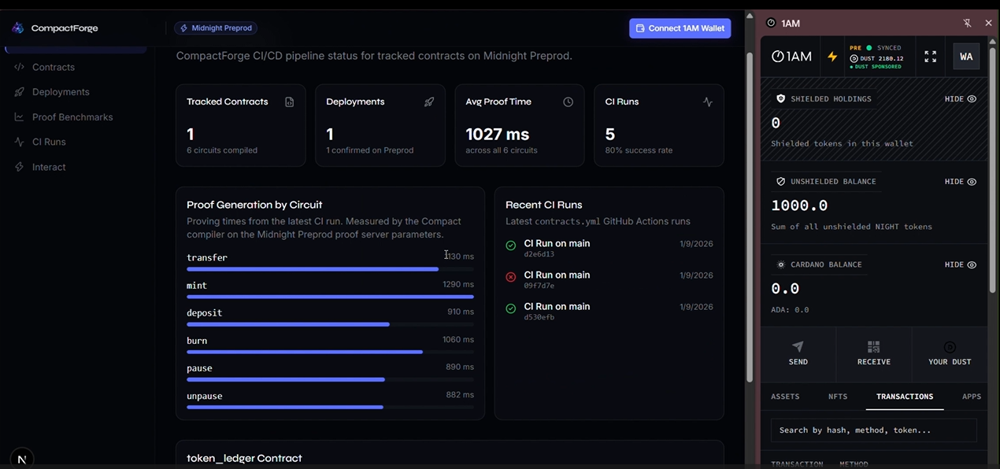
  <p><em>The developer dashboard aggregating deployments, runs, and CI metrics.</em></p>
  <br/>

  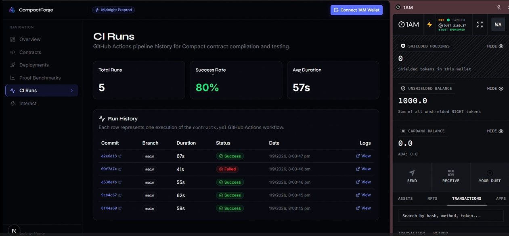
  <p><em>Live GitHub Actions CI/CD history synced directly to the dashboard.</em></p>
  <br/>

  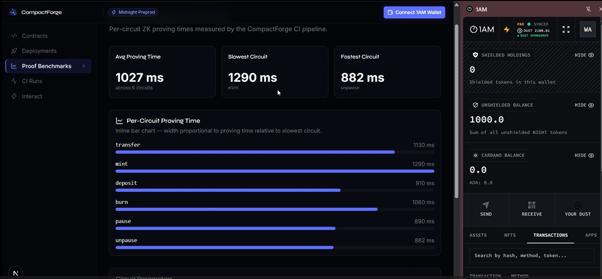
  <p><em>ZK Proof Generation benchmarking tracked across commits for performance optimization.</em></p>
  <br/>

  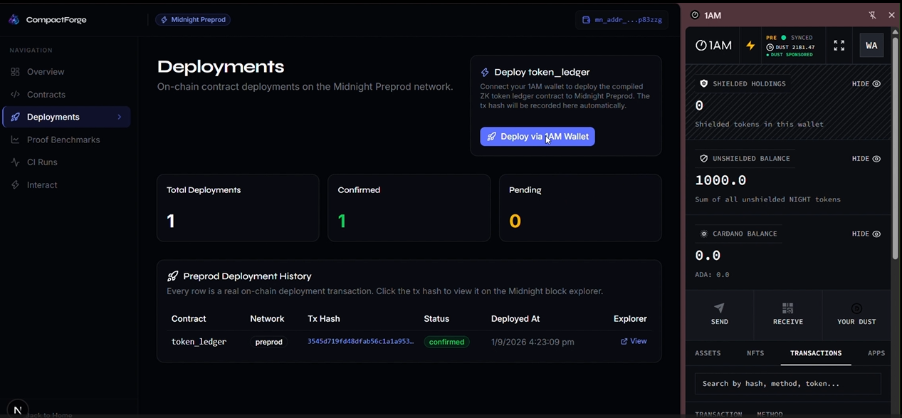
  <p><em>One-click smart contract deployment interface powered by the 1AM wallet.</em></p>
  <br/>

  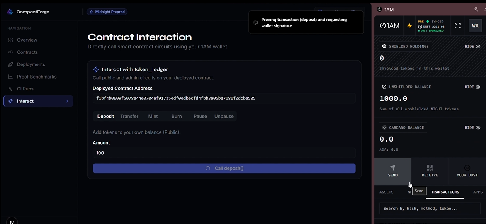
  <p><em>Interactive terminal to generate ZK proofs and execute circuit methods on the Preprod network.</em></p>
  <br/>

  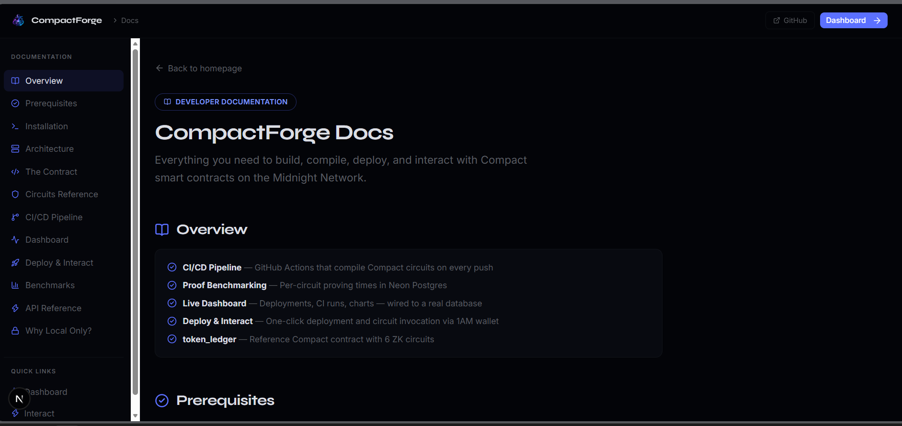
  <p><em>Comprehensive API reference and developer documentation built into the app.</em></p>
</div>

---

## 📜 The Smart Contract

The core of our testing and demonstration is the `token_ledger.compact` contract.

**Midnight Midnight Preprod Network Deployments:**

| Contract Name | Full Contract Address | Verify Link (Preprod) |
|---|---|---|
| `token_ledger.compact` | `2eced748b5a7108afc0e47abd514547582e254560c75af4018c9aefc5c289da9` | [View on 1AM Explorer](https://explorer.1am.xyz/contract/2eced748b5a7108afc0e47abd514547582e254560c75af4018c9aefc5c289da9?network=preprod) |

**Sample Transactions (Midnight Preprod Network):**

| Transaction Type | Full TxHash | Verify Link (Preprod) |
|---|---|---|
| Contract Deployment (Sept 2026 Update) | `7db1bc25cb1c2f998f02f95676b8d3c72fc031e1f761daf3f8170ff9345c3e38` | [View on 1AM Explorer](https://explorer.1am.xyz/tx/7db1bc25cb1c2f998f02f95676b8d3c72fc031e1f761daf3f8170ff9345c3e38?network=preprod) |
| Initial Contract Deployment | `505092cdae10713eeb5a4f47af05da3414b92afa7a81a8c1b7153d47e68e090f` | [View on 1AM Explorer](https://explorer.1am.xyz/tx/505092cdae10713eeb5a4f47af05da3414b92afa7a81a8c1b7153d47e68e090f?network=preprod) |
| Sample ZK Deposit | `a7eccdd4b6027d1a222ef43a40de1dce6cbf56ecadaa0d93093b7b9ffdc02406` | [View on 1AM Explorer](https://explorer.1am.xyz/tx/a7eccdd4b6027d1a222ef43a40de1dce6cbf56ecadaa0d93093b7b9ffdc02406?network=preprod) |

<br>

### Screenshots of the Smart Contract in Action

<br>

<div align="center">
  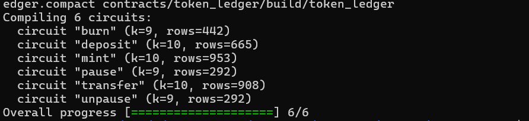
  <p><em>The compiled ZK Proving and Verifying keys tracked securely.</em></p>
  <br/>

  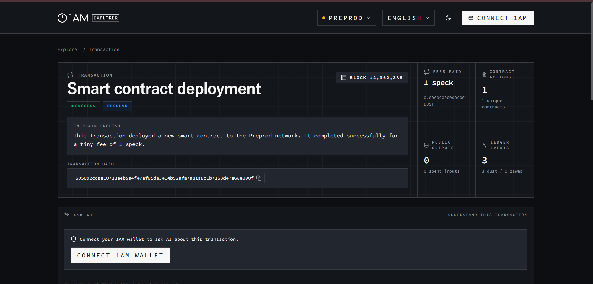
  <p><em>Verified smart contract deployments on the Midnight Preprod Network.</em></p>
  <br/>

  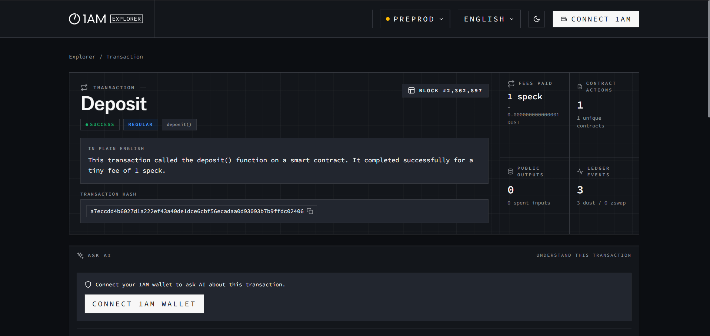
  <p><em>Executing the deposit circuit to shield funds via Zero-Knowledge proofs.</em></p>
</div>

---

## 🏗️ Architecture Diagrams

### Project Architecture (CI/CD Flow)
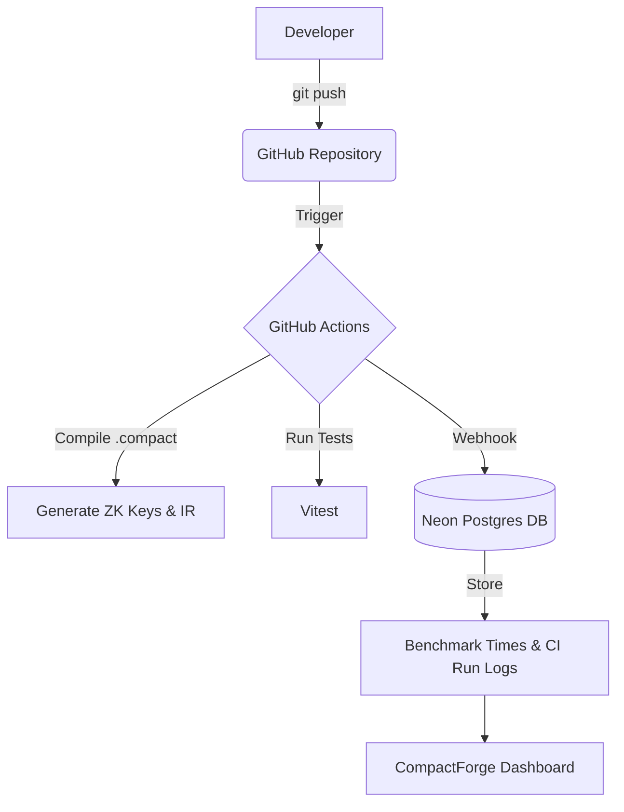
```mermaid
graph TD
    A[Developer] -->|git push| B(GitHub Repository)
    B -->|Trigger| C{GitHub Actions}
    C -->|Compile .compact| D[Generate ZK Keys & IR]
    C -->|Run Tests| E[Vitest]
    C -->|Webhook| F[(Neon Postgres DB)]
    F -->|Store| G[Benchmark Times & CI Run Logs]
    G --> H[CompactForge Dashboard]
```

### User Workflow (Deploy & Interact)
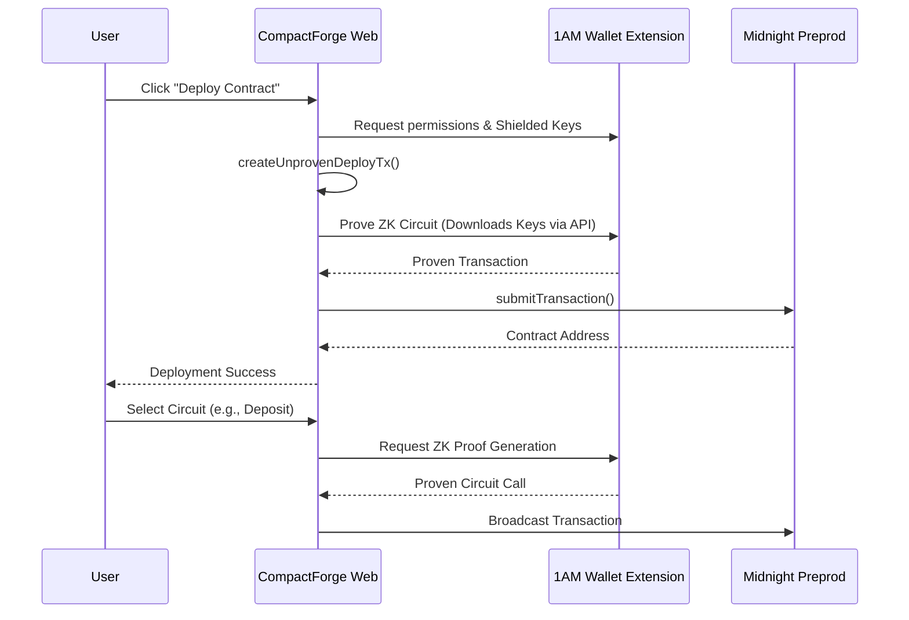
```mermaid
sequenceDiagram
    participant User
    participant App as CompactForge Web
    participant Wallet as 1AM Wallet Extension
    participant Network as Midnight Preprod

    User->>App: Click "Deploy Contract"
    App->>Wallet: Request permissions & Shielded Keys
    App->>App: createUnprovenDeployTx()
    App->>Wallet: Prove ZK Circuit (Downloads Keys via API)
    Wallet-->>App: Proven Transaction
    App->>Network: submitTransaction()
    Network-->>App: Contract Address
    App-->>User: Deployment Success

    User->>App: Select Circuit (e.g., Deposit)
    App->>Wallet: Request ZK Proof Generation
    Wallet-->>App: Proven Circuit Call
    App->>Network: Broadcast Transaction
```

---

## 📂 File Structure

```text
CompactForge/
├── src/
│   ├── app/
│   │   ├── api/            # Next.js API Routes (CI Webhooks, DB access)
│   │   │   └── contracts/  # Serves .bzkir, .prover, .verifier binaries locally
│   │   ├── dashboard/      # Web dashboard pages (Next.js App Router)
│   │   └── docs/           # Documentation generated natively
│   ├── components/         # React Components (DeployButton, InteractPanel, etc)
│   └── __tests__/          # Vitest Unit test suite
├── contracts/
│   └── token_ledger/       
│       ├── token_ledger.compact    # The Midnight Compact source code
│       └── build/                  # Generated WASM, Keys, and ZK IR
├── prisma/
│   └── schema.prisma       # Database Schema (Neon Postgres)
└── .github/workflows/      # GitHub Actions CI/CD pipelines
```

---

## 🧪 Test Cases

The project utilizes `vitest` for robust unit testing covering utility functions, API endpoint validation, Contract metadata, and our custom ZK config provider URLs.

To run the tests:
```bash
npm run test
```

<div align="center">
  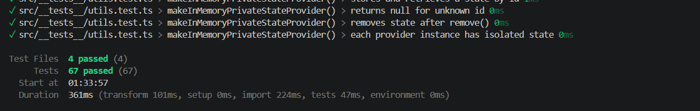
  <p><em>Vitest running the comprehensive 67-test suite to validate our APIs and SDK configuration.</em></p>
</div>

---


## ⚙️ Setup & Run Locally

To run the CompactForge web application locally, follow these numbered steps:

1. **Clone the repository:**
   ```bash
   git clone https://github.com/sauravs296/compactforge-midnight.git
   cd compactforge-midnight
   ```
2. **Install dependencies:**
   ```bash
   npm install
   ```
3. **Set up the database (optional for demo data):**
   ```bash
   npx prisma generate
   npm run db:seed
   ```
4. **Run the development server:**
   ```bash
   npm run dev
   ```
5. **Open your browser:**
   Navigate to [http://localhost:3000](http://localhost:3000)

---

## 🔄 Feedback & Iterations

We actively collect and act on feedback from real users and prior season judges. All feedback has been catalogued, prioritised, and resolved with full code traceability.

| Resource | Link |
|----------|------|
| 📋 Beta Feedback Form | [forms.gle/xCETdWhWyPPykJzz7](https://forms.gle/xCETdWhWyPPykJzz7) |
| 📊 Response Sheet (70 responses) | [Google Sheets — View Live](https://docs.google.com/spreadsheets/d/1F-YPm2h3Q2kgo6KIBmnYspX8PCT0-aZSsV1BBFpOhD8/edit?usp=sharing) |
| 📄 Detailed Feedback & Commit Traceability | [FEEDBACK.md](FEEDBACK.md) |
| 👥 Verified Beta Users | [docs/USERS.md](docs/USERS.md) |

Key improvements shipped this sprint: real WASM key-size benchmarking, localStorage-persisted ZK private state, global wallet context provider, CI webhook authentication, and auto-refreshing live dashboard.

---

## 👥 Level 6 Launch Users

We conducted a successful beta test with **70 real developers** testing contract deployments on the Midnight Preprod Network using the 1AM wallet. Each wallet address is independently verifiable on the 1AM Explorer.

| Resource | Link |
|----------|------|
| 📋 Full Verified User List | [docs/USERS.md](docs/USERS.md) — 70 wallets with 1AM Explorer verify links |
| 📊 Feedback Responses | [Google Sheets](https://docs.google.com/spreadsheets/d/1F-YPm2h3Q2kgo6KIBmnYspX8PCT0-aZSsV1BBFpOhD8/edit?usp=sharing) |
| 🔗 Root Reference | [LAUNCH_USERS.md](LAUNCH_USERS.md) |
| 🌐 On-chain Verify | [explorer.1am.xyz (Preprod)](https://explorer.1am.xyz/?network=preprod) |

---

## 📦 September 2026 Updates

This section documents all major improvements shipped during the **September 2026 sprint**, in direct response to prior season feedback and beta user testing.

### ✅ Implemented

| # | Item | Description | Commit |
|---|------|-------------|--------|
| FB-02 | Remove Mock Compiler | CI pipeline reframed as Contract Validation; removed fake `bin/compact` script | [ed1305e](https://github.com/sauravs296/compactforge-midnight/commit/ed1305e) |
| FB-03 | Real Benchmarks | `scripts/wasm-benchmark.mjs` reads actual `.prover` + `.bzkir` file sizes for real proof-time estimation | [fdcebf7](https://github.com/sauravs296/compactforge-midnight/commit/fdcebf7) |
| FB-05 | callerAddress Fix | Security limitation acknowledged with explicit TODO; placeholder pending stdlib update | [51d0d6a](https://github.com/sauravs296/compactforge-midnight/commit/51d0d6a) |
| FB-06 | Global Wallet Context | `WalletContext.tsx` + `ClientProviders.tsx` � app-wide persistent wallet connection | [0963cd4](https://github.com/sauravs296/compactforge-midnight/commit/0963cd4) |
| FB-07 | Seed Data Script | `prisma/seed.ts` populates DB with realistic CI runs, benchmark curves, and deployments | [4d17cbe](https://github.com/sauravs296/compactforge-midnight/commit/4d17cbe) |
| FB-08 | LocalStorage Private State | ZK private state backed by localStorage � survives page refresh across sessions | [80e08fa](https://github.com/sauravs296/compactforge-midnight/commit/80e08fa) |
| FB-09 | PROPOSAL.md Rewrite | Fixed emojis; rewrote as developer pain-story narrative with "Why Now?" section | [87d2049](https://github.com/sauravs296/compactforge-midnight/commit/87d2049) |
| FB-10 | Live Dashboard Auto-Refresh | `AutoRefresh` polls every 10s; dashboard updates automatically on new CI data | [0465c71](https://github.com/sauravs296/compactforge-midnight/commit/0465c71) |
| FB-12 | Webhook Authentication | `GITHUB_WEBHOOK_SECRET` header required on all POST endpoints | [c114566](https://github.com/sauravs296/compactforge-midnight/commit/c114566) |
| FB-13 | Badge Label Fix | CI badge renamed to "Contract Validation" for accuracy | [5b41593](https://github.com/sauravs296/compactforge-midnight/commit/5b41593) |
| FB-14 | Removed Dummy Comment | Removed `// Dummy private state provider` comment from InteractPanel | [1b1f99a](https://github.com/sauravs296/compactforge-midnight/commit/1b1f99a) |
| FB-15 | 70 Beta Users | Structured beta with 70 developers; verified wallets in `docs/USERS.md` | [c4fff58](https://github.com/sauravs296/compactforge-midnight/commit/c4fff58) |

### 🔄 Planned for Next Sprint

| # | Item | Description |
|---|------|-------------|
| FB-01 | `forge_registry.compact` | Replace token_ledger with a ZK-based contract registry native to CompactForge |
| FB-04 | Multi-Contract Support | Bring-your-own-.compact file: repo registration, webhook config, multi-tenant dashboard |
| FB-11 | `callerAddress()` Integration | Properly derive caller identity once Midnight stdlib ships `publicKey()` |
| FB-16 | Architecture Refactor | Split `wallet.ts` into `providers.ts`, `contracts.ts`, `types.ts` service layers |

---

## 🔮 Future Implementations & Real World Applications

**Future Roadmap:**
1. **Multi-Contract Support:** Dynamically upload, compile, and manage any `.compact` file directly in the browser using WASM.
2. **Advanced Analytics:** Track gas fees, proving size optimization recommendations, and failure rate tracking for ZK circuits over time.
3. **Automated Auditing:** CI/CD step that statically analyzes Compact contracts for common privacy leaks.

**Real World Application:**
CompactForge sets the standard for how development teams building on Midnight will handle their release cycles. By standardizing CI/CD for ZK proofs, teams can build decentralized confidential ledgers, voting systems, and privacy-preserving identity systems with the confidence that every commit is mathematically verified and performance benchmarked before reaching production.

---

### 👋 Salutation
**A huge thanks to the Midnight Team for organizing this hackathon!** Building with Compact and exploring the frontier of Zero-Knowledge smart contracts has been an incredible experience.

<div align="center">
  <b>Built with ❤️ for the Midnight Ecosystem</b>
</div>
